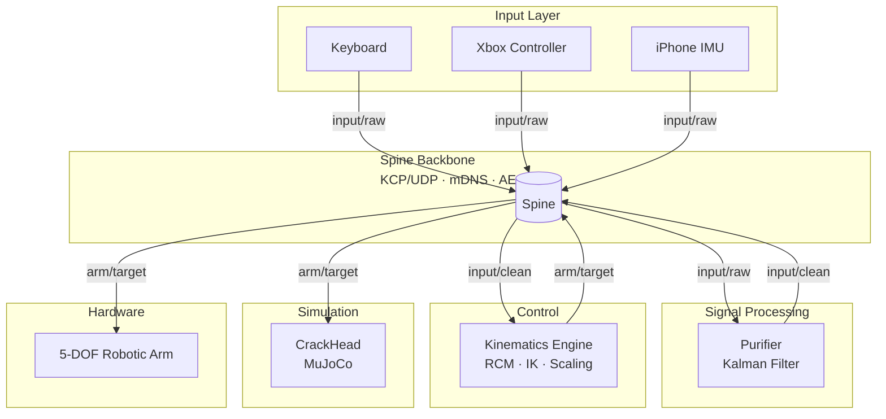

# Architecture

PreciCore is built as a graph of loosely coupled nodes connected by the Spine communication backbone. Each node has a single responsibility and communicates exclusively through typed pub/sub topics or RPC calls — no direct function calls between nodes.

## Full system diagram

## Data flow

| Step | Topic | Description |
|------|-------|-------------|
| 1. Operator input | `input/raw` | Raw axis values from keyboard, Xbox controller, or iPhone IMU |
| 2. Tremor filtering | `input/raw` → `input/clean` | Purifier applies a Kalman filter to remove noise and tremor |
| 3. Routing | — | Spine routes all messages over KCP/UDP with mDNS discovery |
| 4. Inverse kinematics | `input/clean` → `arm/target` | Kinematics Engine computes joint angles with RCM constraint |
| 5. Execution | `arm/target` | CrackHead validates in simulation; hardware arm executes in production |

## Design principles

**Everything is a node.** Input devices, filters, simulators, and hardware drivers are all Spine nodes. Adding a new capability means writing a new node — not modifying existing ones.

**Topics are the contract.** Nodes are decoupled from each other. The only shared interface is the topic name and message type. A new input device only needs to publish `input/raw` in the correct format to integrate into the pipeline.

**Simulation is mandatory.** CrackHead is not optional in the development workflow. Every trajectory is validated on the virtual phantom cornea before any command reaches real hardware.

**No centralised orchestrator.** Spine uses mDNS for zero-config discovery. There is no master node, no launch file, and no manual IP configuration.

## Component summary

| Component | Language | Role |
|-----------|----------|------|
| [Spine](/docs/spine/intro) | Go / Python / C++ | Communication backbone |
| [Purifier](/docs/spine-nodes/purifier/intro) | Go | Kalman filter on `input/raw` |
| [Kinematics Engine](/docs/spine-nodes/kinematics-engine/intro) | C++ | Inverse kinematics + RCM |
| [CrackHead](/docs/spine-nodes/crack-head/intro) | C++ / MuJoCo | Physics simulation |
| [Input nodes](/docs/spine-nodes/input/intro) | Go | Keyboard, Xbox, iPhone IMU |
