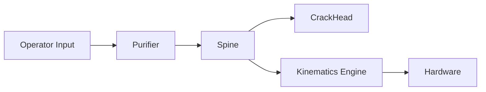

# Spine

Spine is PreciCore's custom robotics communication framework — a lightweight, ROS-like middleware built from scratch. It provides real-time pub/sub messaging and RPC service calls across all modules of the PreciCore system.

## Why Spine?

ROS 2 introduces significant complexity — IDL files, DDS middleware, Colcon build tools, and heavy OS-level dependencies. Spine eliminates all of that. Any function can be exposed as a network-discoverable service in a few lines of code, using KCP over UDP for low-jitter performance and AES-GCM encryption for namespace isolation.

## Architecture

## Implementations

| Package | Language | Status |
|---------|----------|--------|
| spine-go | Go | ✅ Active |
| spine-py | Python | ✅ Active |
| spine-cpp | C++ | ✅ Active |
| spine-mad | Go | ✅ Active |
